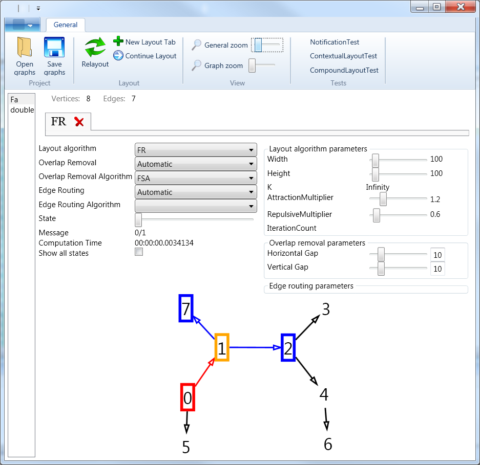
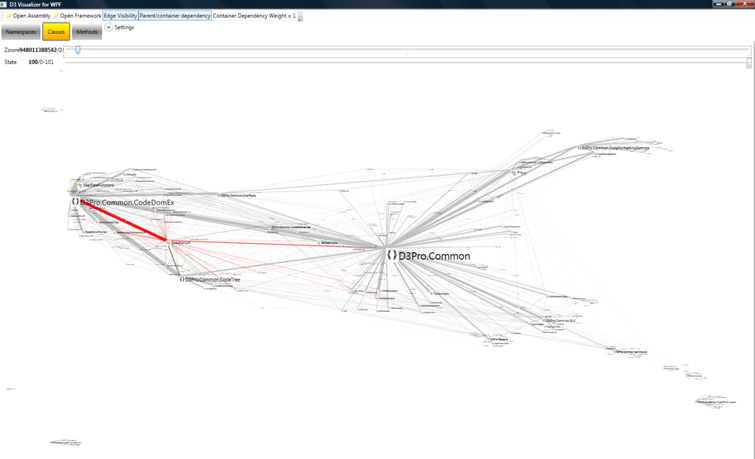

# Graph#

Based on [CodePlex Graph#](http://graphsharp.codeplex.com/)

## Project Description
Graph# is a graph layout framework.
It contains some layout algorithms and a GraphLayout control for WPF applications.

## Depends on:
Microsoft Code Contracts http://msdn.microsoft.com/en-us/devlabs/dd491992.aspx
QuickGraph http://quickgraph.codeplex.com
NDepend

## Features
### Supported layout algorithms:
- Fruchterman - Reingold
- Kamada - Kawai
- ISOM
- LinLog
- Simple Tree layout
- Simple Circle layout
- NEW Sugiyama layout (Use the Efficient Sugiyama layout algorithm)
- NEW Compound graph layout (CompoundFDP algorithm)
- on the way:
radial tree
balloon tree
Orthogonal layout

### Supported overlap removal algorithms:
- Force-Scan Algorithm

### Edge layout algorithms also supported!
- on the way: orthogonal edge layout

### Highlight algorithms supported!
- Simple highlight algorithm (highlight vertex/edge & neigbours)

### GraphLayout WPF control!
- Can use all kinds of algorithms (layout, overlap removal, edge, highlight)
- Vertex dragging supported
- Templates for vertices and edges supported
- Mutable graph -> automatic relayout after the graph changes (burst mode: lot of modification but only 1 relayout)
- Async layout (background thread) supported
- Position changes are animated!

## Examples

### Example application included!

### Dependency Graph with LinLog layout using Graph#.Controls.GraphLayout control and Graph# lib

